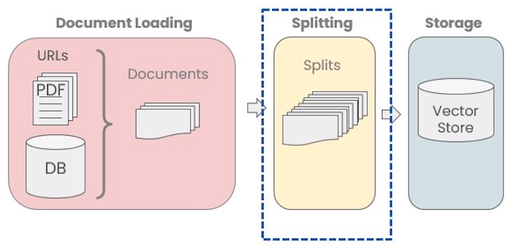
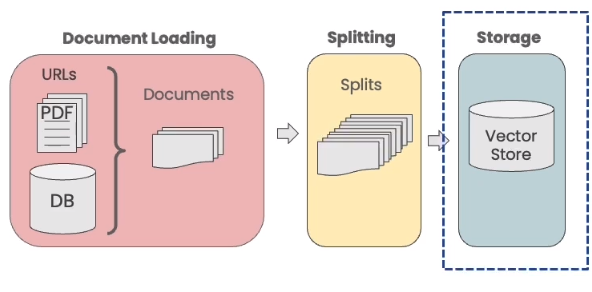
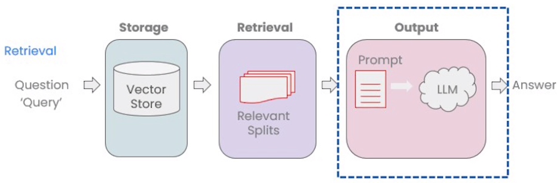
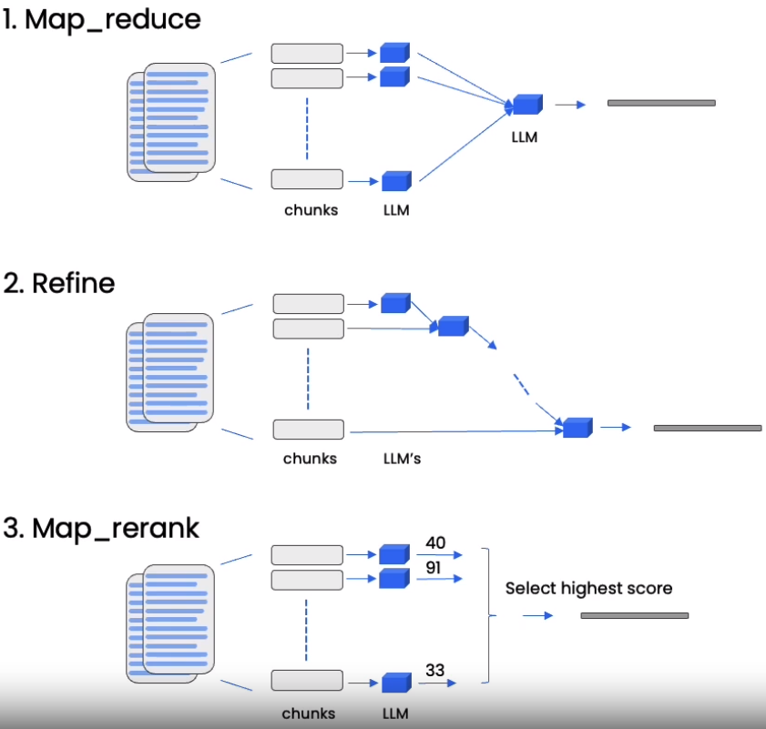
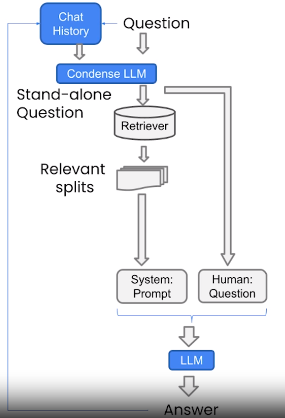

#  [LangChain: Chat with Your Data](https://www.deeplearning.ai/short-courses/langchain-chat-with-your-data/?utm_campaign=langchain-launch&utm_medium=email&_hsmi=265152429&_hsenc=p2ANqtz-9UlYz5c-nRZMfgLCGV8A8NUouNPlJfr2zlCSVvOQ1Ma_u2OkBGboSEw-clvdMEiHEAqv123vqBbIPY616OFPjKODkF4g&utm_content=265152429&utm_source=hs_email) 

 Welcome to the "LangChain: Chat with Your Data" course! Learn directly from the LangChain creator, Harrison Chase, and discover the power of LangChain in building chatbots that interact with information from your own documents and data. 

**LangChain**:  🔗[GitHub](https://github.com/hwchase17/langchain), 📚[Documentation](https://python.langchain.com/en/latest/index.html)

## Course Summary
 A short course on LangChain: Chat With Your Data! Explore two main topics: Retrieval Augmented Generation (RAG) and building a chatbot. Unlock the potential of Large Language Models (LLMs) to retrieve contextual documents and create chatbots that respond using your own data. 

You'll learn about:
1.  **Document Loading**: Access over 80 unique loaders provided by LangChain to handle various data sources, including audio and video.

 

2.  **Document Splitting**: Discover best practices and considerations for splitting data effectively.

 

3.  **Vector Stores and Embeddings**: Dive into embeddings and explore vector store integrations within LangChain.

 

4.  **Retrieval**: Grasp advanced techniques for accessing and indexing data in the vector store to retrieve relevant information beyond semantic queries.

 

5.  **Question Answering**: Build a one-pass question-answering solution.

 

6.  **Chat**: Track and select pertinent information from conversations and data sources to build your own chatbot using LangChain.

 

 Start building practical applications that allow you to interact with data using LangChain and LLMs. 

## Key Points
-  Learn directly from the LangChain creator, Harrison Chase.
-  Apply LLMs to your proprietary data and develop personalized assistants and specialized chatbots. 
-  Expand your utilization of LLMs through agents, chained calls, and memories. 

## About the Instructors
**Harrison Chase** is Co-Founder and CEO at LangChain.

**Andrew Ng** is Renowned AI researcher, co-founder of Coursera, and the founder of DeepLearning.AI. With a wealth of knowledge and expertise in the field, Andrew has played a pivotal role in popularizing AI education.

 Reference: "LangChain: Chat with Your Data" course. To enroll in the course or for further information, visit [deeplearning.ai](https://www.deeplearning.ai).
